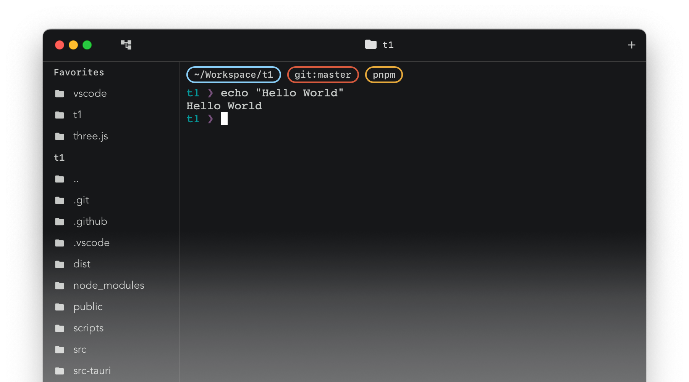

# Terminal One

Terminal One is a blazingly fast, smart and and friendly terminal emulator for developers.



## Features

- **Various feature integration:** Terminal one include various feature integration that help you to level up your productivity.
Click the button directly or press `CTRL+NUM` to run the command.
- **File Explorer:** Terminal One provides a file explorer that helps you to
navigate through your files and folders easily.
Terminal One will track your current working directory
and will open the file explorer in that directory.
Everything is done naturally and automatically.
- **CPU Monitor:** Monitoring the CPU usage of the running program in the terminal is a very common task for developers.
Terminal One provides a CPU monitor that help you to monitor the running program in real-time.

## Development

```sh
pnpm i
pnpm tauri dev
```

## Env

- T1_FORCE_ONBOARDING: Force the terminal show the onboarding

## Recommended IDE Setup

- [VS Code](https://code.visualstudio.com/) + [Tauri](https://marketplace.visualstudio.com/items?itemName=tauri-apps.tauri-vscode) + [rust-analyzer](https://marketplace.visualstudio.com/items?itemName=rust-lang.rust-analyzer)
